***PROYECTO FINALIZADO***

# Sistemas escalables
## Primera étapa, sistema monólitico: 

### **Setup de las máquinas virtuales:**

En esta primera étapa, iniciamos creando dos máquinas virtuales (EC2) de manera individual y en estas máquinas desplegar una app básica con wordpress, estas máquina tenían asociadas una IP elástica para evitar que la IP fuese variando con el tiempo y pudiese asociarse adecuadamente a un DNS. También logramos asociarles un certificado SSL a estas máquinas virtuales.

**lastimosamente por razones ajenas, las máquinas dentro del curso fueron canceladas.**

Como estrategia alternativa, creamos nuevamente una máquina virtual para empezar a trabajar en el proyecto, alcanzamos a montarle nuevamente una aplicación wordpress, pero antes de añadirle el certificado SSL, **surgieron nuevos problemas con el acceso a la máquina, aunque esta vez no fue tumbada**, por estos incovenientes no tenemos pruebas de la configuración de la máquina en EC2.

### **Solicitud de dominio y administración del DNS:**

- Teniendo ya una máquina virtual funcionando con wordpress, utilizamos un dominio ofrecido por freenom "atenea.ml"

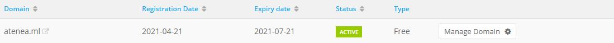

- Luego de tener el dominio, nos registramos en cloudflare para asociarle este dominio, inicialmente registramos el sitio: 

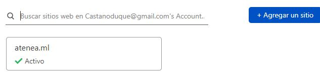

- Después de tener registrado el dominio, configuramos los registros DNS para que nuestro dominio resolviera la ip elástica de nuestra máquina virtual.

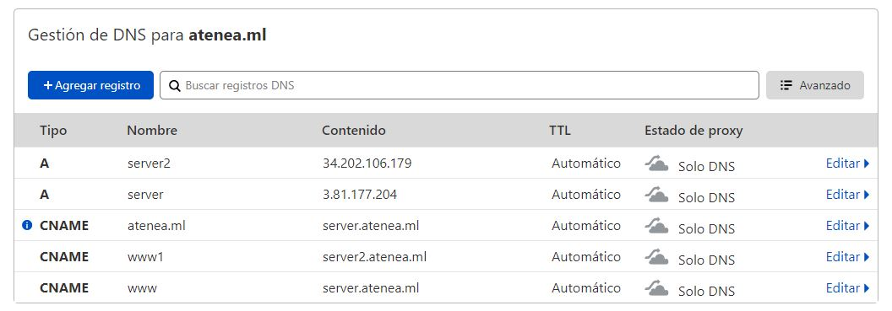

- Finalmente, para poder que clodflare fuera el encargado de administrar este dominio, nos ofrecía dos DNS autoritarios, los cuales cambiamos en freenom, para que quedaran delegados a estos mismos. 

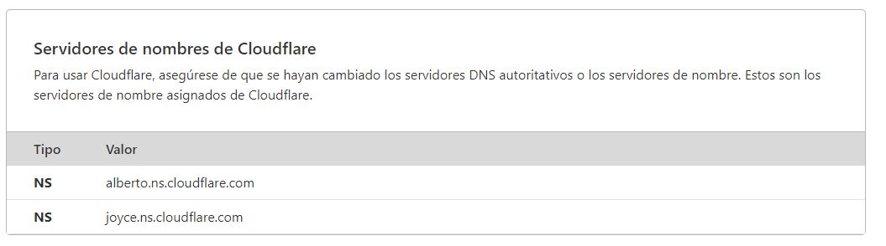

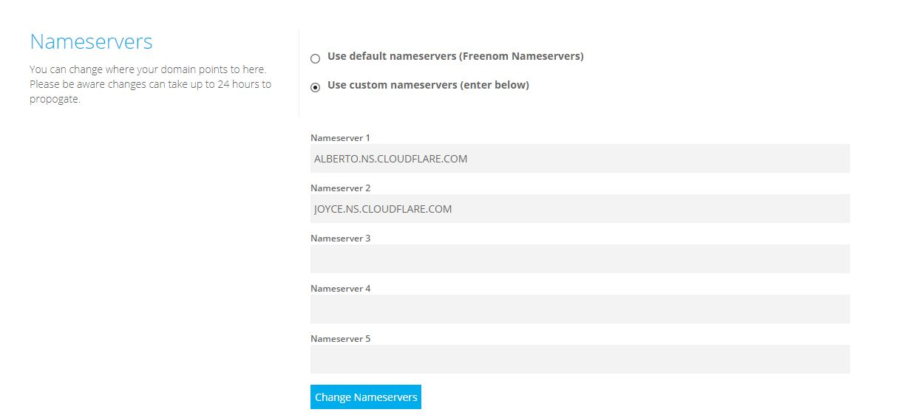

### **Características funcionales:**

A la hora de montar la estructura del WordPress, y pensando en los requisitos de lo que debía ser el sistema, “una comunidad de aprendizaje” en la cual se puedan crear grupos y compartir información entre estudiantes en diferentes materias de interés.

ATENEA implemento una red social de aprendizaje en la cual puedes contar con perfiles, grupos, interacción con otros usuarios, mensajería, entre otras funcionalidades, para esta se utilizó diversos pluggins de WordPress, entre ellos BUDDYPRESS para montar la red social, WOOSTIFY el cual es el tema inicial para que la vista sea un poco más agradable para el usuario, Activity Plus Reloaded for BuddyPress para subir archivos a los grupos y BuddyPress Edit Activity para realizar ediciones a los contenidos subidos previamente.  

Cabe mencionar que estos pluggins son iniciales para esta comunidad de aprendizaje y en futuras entregas se modificaran elementos para perfeccionar funcionalidades 

 

Por problemas de verificación y certificación SSL, por el momento tenemos el login por defecto en WordPress 

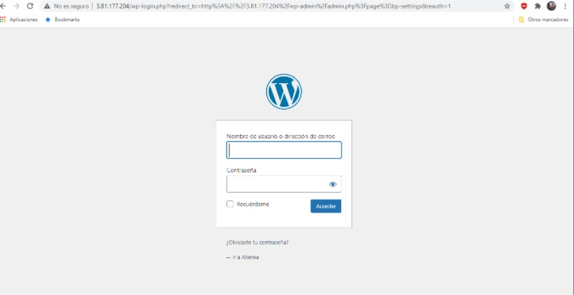

Tenemos un menú principal básico

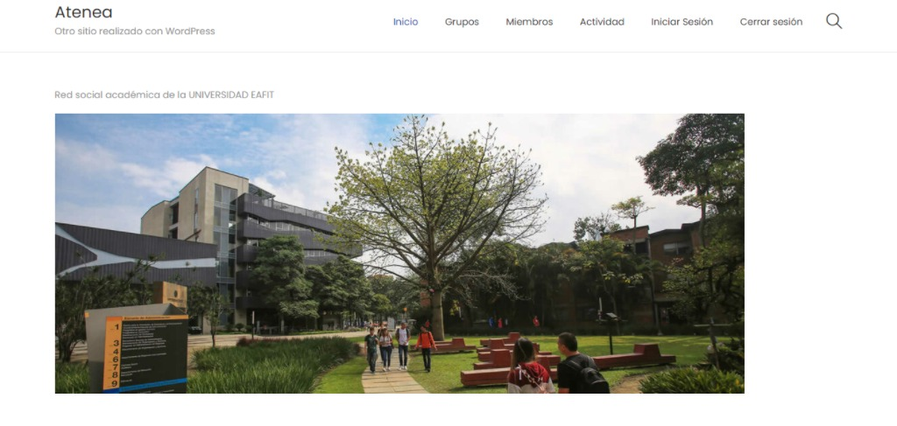

En el menú GRUPOS tenemos los diferentes tipos de grupos creados por usuarios. 

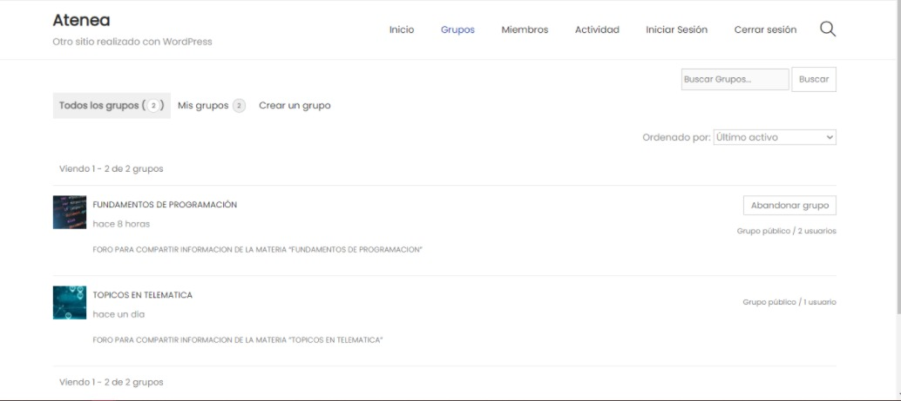

En los grupos podemos visualizar los miembros, administradores del grupo, un apartado de invitar al grupo, y los administradores pueden gestionar el grupo. 
Nota: podemos notar que se pueden subir archivos, videos y fotos al grupo, además del propietario poder editarlos. 

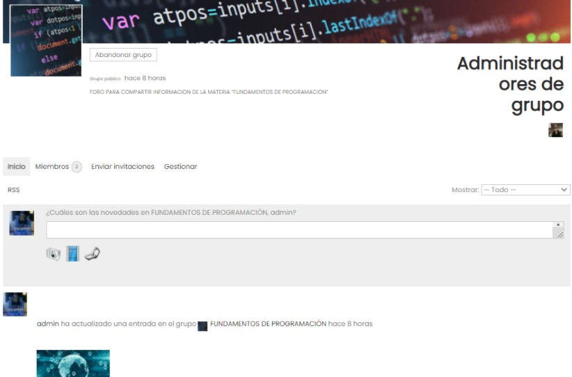

En el apartado miembros tenemos los diferentes usuarios que están en la plataforma, aquí se puede enviar la solicitud de amistad para así interactuar uno con el otro 

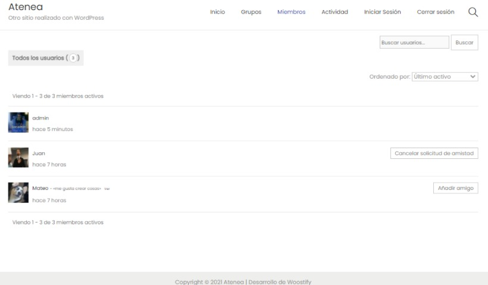

En actividad están todas las interacciones que han realizado los usuarios, es algo similar al inicio de FACEBOOK 

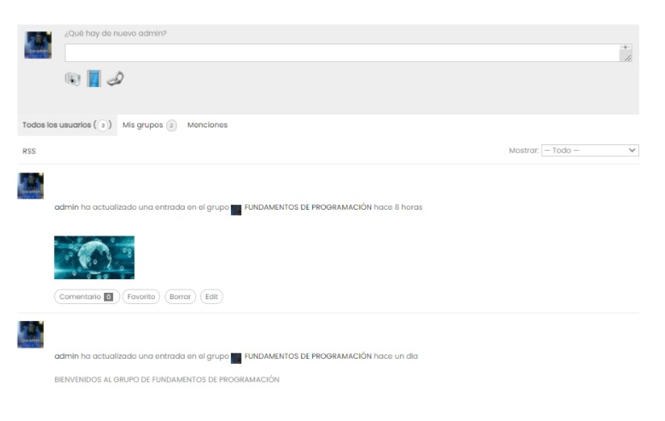

**Integrantes:**
- Juan Pablo Castaño Duque: jpcastand@eafit.edu.co
- Mateo Montes Loaiza: mmontesl1@eafit.edu.co

**URL:**
- www.atenea.ml
--------------------------------------------------------------------------------------------------------------------------------------------------------------------------------
## Segunda étapa, sistema escalable: 

**Integrantes:**
- Juan Pablo Castaño Duque: jpcastand@eafit.edu.co
- Mateo Montes Loaiza: mmontesl1@eafit.edu.co

**URL:**
- www.ateneatest.tk

para la realizacion del sistema escalable, Atenea Interprise realizo una serie de pasos en las cuales tuve que crear diversos elemento los cuales se mencionaran en el siguiente documento.
inicialmente se creo un VPC en AWS el cual su principal mision es lanzar recursos de AWS en una red virtual, esta red es identica a las redes tradicionales que utilizan propios centros de datos, con los beneficios que supone utilizar la infraestructura escalable de AWS.

posteriormente se crean 4 tipos de subredes en las cuales encontramos 2 privadas y 2 publicas

### **route tables**

### **se asocio el NAT con el SUBNET privado ya que por si solo no tiene salida a internet, este funciona como un intermediario para su conexión**

### **montamos el internet gateways el cual es la conexion a internet de las cosas que hay en el vpc**

### **posteriormente se realiza la asociacion del internet gateway y el subnet**

### **se crea el security Group**

### **se realiza las instancias NAT para permitir a las privadas acceso a internet**

### **la funcionalidad del Bastion es ofrecer seguridad a la red interna, por lo que ha sido especialmente configurado para la recepción de ataques.**

### **Base de datos**

### **Sistema de archivos**

### **Web server, aqui se almacena la imagen (las plantillas por si se caen)**

### **El Balanceador de carga direcciona a un cliente al servidor web que se encuentre con mayor disponibilidad entre los que cuentan con el mismo contenido**

### **Configuración de lanzamiento para que posteriormente en Auto Scaling suba las maquinas**

### **Auto scaling realiza la accion de subir las maquinas**

### **DNS almacenados en cloudflare**

### **certificado de seguridad SSL para demostrar al usuario final que la pagina a la cual ingresara es segura y confiable**

# CARACTERISTICAS FUNCIONALES

*SISTEMA DE LOGIN SSO*

### **comunidad de aprendizaje**
A la hora de montar la estructura del WordPress, y pensando en los requisitos de lo que debía ser el sistema, “una comunidad de aprendizaje” en la cual se puedan crear grupos y compartir información entre estudiantes en diferentes materias de interés.

ATENEA implemento una red social de aprendizaje en la cual puedes contar con perfiles, grupos, interacción con otros usuarios, mensajería, entre otras funcionalidades, para esta se utilizó diversos pluggins de WordPress, entre ellos BUDDYPRESS para montar la red social, WOOSTIFY el cual es el tema inicial para que la vista sea un poco más agradable para el usuario, Activity Plus Reloaded for BuddyPress para subir archivos a los grupos y BuddyPress Edit Activity para realizar ediciones a los contenidos subidos previamente. 

*Existen diversos grupos los cuales tienen distintos tipos de interes, como se muestra en la imagen*

*En estos grupos se pueden realizar publicaciones, montar imaneges, archivos, textos, videos entre otras* 

*hay un apartado el cual muestra todos los miembros de la comunidad*

*Actividad reciente*

*Un apartado Perfil el cual se puede personalizar y se muestra notificaciones, solicitudes de amistad, comentarios de mis publicaciones, entre otras*

